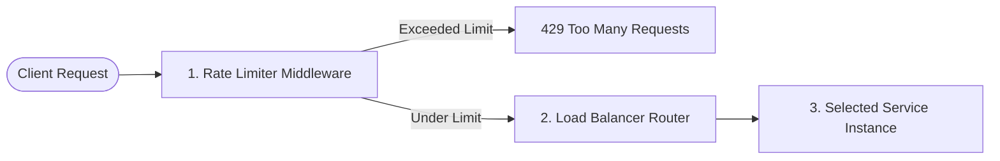

Yes, Rate Limiting is based on IP Address (127.0.0.1): In rateLimitMiddleware.ts, the rate limiter tracks client IPs. Because you are testing everything locally on your machine, all browser requests and terminal requests share the exact same IP: 127.0.0.1.

Window Accumulation: When previous automated tests or rapid clicks occurred within the 60-second sliding window, 127.0.0.1 accumulated requests. Even if you typed a new email into the form, the Gateway saw that the request originated from 127.0.0.1 and blocked it until the window cleared. 


Only 100 req getting passed because in rate limiter we set only 100 req 
so loadbalancer can process only 100

Mon  5 Oct - 20:47  ~/apigateway   origin ☊ main 18☀ 7● 1‒ 
 @bumblebee  ./test-algo.sh
======================================================
🚀 Booting 20 instances of product-service...
⚙️  Algorithm: RANDOM
======================================================
Stopping any existing PM2 Gateway processes...

📡 Sending 200 requests...
------------------------------------------------------
Sending 200 requests to http://localhost:8000/api/products...
Request 1 → product-service-localhost-4017   ✓ (Strategy: RANDOM)
Request 2 → product-service-localhost-4019   ✓ (Strategy: RANDOM)
Request 3 → product-service-localhost-4016   ✓ (Strategy: RANDOM)
Request 4 → product-service-localhost-4017   ✓ (Strategy: RANDOM)
Request 5 → product-service-localhost-4007   ✓ (Strategy: RANDOM)
Request 6 → product-service-localhost-4001   ✓ (Strategy: RANDOM)
Request 7 → product-service-localhost-4005   ✓ (Strategy: RANDOM)
Request 8 → product-service-localhost-4003   ✓ (Strategy: RANDOM)
Request 9 → product-service-localhost-4015   ✓ (Strategy: RANDOM)
Request 10 → product-service-localhost-4012   ✓ (Strategy: RANDOM)
Request 11 → product-service-localhost-4018   ✓ (Strategy: RANDOM)
Request 12 → product-service-localhost-4008   ✓ (Strategy: RANDOM)
Request 13 → product-service-localhost-4004   ✓ (Strategy: RANDOM)
Request 14 → product-service-localhost-4002   ✓ (Strategy: RANDOM)
Request 15 → product-service-localhost-4017   ✓ (Strategy: RANDOM)
Request 16 → product-service-localhost-4002   ✓ (Strategy: RANDOM)
Request 17 → product-service-localhost-4018   ✓ (Strategy: RANDOM)
Request 18 → product-service-localhost-4016   ✓ (Strategy: RANDOM)
Request 19 → product-service-localhost-4011   ✓ (Strategy: RANDOM)
Request 20 → product-service-localhost-4020   ✓ (Strategy: RANDOM)
Request 21 → product-service-localhost-4004   ✓ (Strategy: RANDOM)
Request 22 → product-service-localhost-4016   ✓ (Strategy: RANDOM)
Request 23 → product-service-localhost-4009   ✓ (Strategy: RANDOM)
Request 24 → product-service-localhost-4003   ✓ (Strategy: RANDOM)
Request 25 → product-service-localhost-4008   ✓ (Strategy: RANDOM)
Request 26 → product-service-localhost-4020   ✓ (Strategy: RANDOM)
Request 27 → product-service-localhost-4020   ✓ (Strategy: RANDOM)
Request 28 → product-service-localhost-4004   ✓ (Strategy: RANDOM)
Request 29 → product-service-localhost-4016   ✓ (Strategy: RANDOM)
Request 30 → product-service-localhost-4006   ✓ (Strategy: RANDOM)
Request 31 → product-service-localhost-4005   ✓ (Strategy: RANDOM)
Request 32 → product-service-localhost-4001   ✓ (Strategy: RANDOM)
Request 33 → product-service-localhost-4012   ✓ (Strategy: RANDOM)
Request 34 → product-service-localhost-4017   ✓ (Strategy: RANDOM)
Request 35 → product-service-localhost-4006   ✓ (Strategy: RANDOM)
Request 36 → product-service-localhost-4010   ✓ (Strategy: RANDOM)
Request 37 → product-service-localhost-4015   ✓ (Strategy: RANDOM)
Request 38 → product-service-localhost-4005   ✓ (Strategy: RANDOM)
Request 39 → product-service-localhost-4002   ✓ (Strategy: RANDOM)
Request 40 → product-service-localhost-4013   ✓ (Strategy: RANDOM)
Request 41 → product-service-localhost-4016   ✓ (Strategy: RANDOM)
Request 42 → product-service-localhost-4006   ✓ (Strategy: RANDOM)
Request 43 → product-service-localhost-4018   ✓ (Strategy: RANDOM)
Request 44 → product-service-localhost-4017   ✓ (Strategy: RANDOM)
Request 45 → product-service-localhost-4015   ✓ (Strategy: RANDOM)
Request 46 → product-service-localhost-4007   ✓ (Strategy: RANDOM)
Request 47 → product-service-localhost-4009   ✓ (Strategy: RANDOM)
Request 48 → product-service-localhost-4018   ✓ (Strategy: RANDOM)
Request 49 → product-service-localhost-4009   ✓ (Strategy: RANDOM)
Request 50 → product-service-localhost-4009   ✓ (Strategy: RANDOM)
Request 51 → product-service-localhost-4010   ✓ (Strategy: RANDOM)
Request 52 → product-service-localhost-4010   ✓ (Strategy: RANDOM)
Request 53 → product-service-localhost-4004   ✓ (Strategy: RANDOM)
Request 54 → product-service-localhost-4001   ✓ (Strategy: RANDOM)
Request 55 → product-service-localhost-4018   ✓ (Strategy: RANDOM)
Request 56 → product-service-localhost-4009   ✓ (Strategy: RANDOM)
Request 57 → product-service-localhost-4015   ✓ (Strategy: RANDOM)
Request 58 → product-service-localhost-4006   ✓ (Strategy: RANDOM)
Request 59 → product-service-localhost-4019   ✓ (Strategy: RANDOM)
Request 60 → product-service-localhost-4018   ✓ (Strategy: RANDOM)
Request 61 → product-service-localhost-4012   ✓ (Strategy: RANDOM)
Request 62 → product-service-localhost-4015   ✓ (Strategy: RANDOM)
Request 63 → product-service-localhost-4018   ✓ (Strategy: RANDOM)
Request 64 → product-service-localhost-4016   ✓ (Strategy: RANDOM)
Request 65 → product-service-localhost-4003   ✓ (Strategy: RANDOM)
Request 66 → product-service-localhost-4017   ✓ (Strategy: RANDOM)
Request 67 → product-service-localhost-4014   ✓ (Strategy: RANDOM)
Request 68 → product-service-localhost-4011   ✓ (Strategy: RANDOM)
Request 69 → product-service-localhost-4014   ✓ (Strategy: RANDOM)
Request 70 → product-service-localhost-4002   ✓ (Strategy: RANDOM)
Request 71 → product-service-localhost-4019   ✓ (Strategy: RANDOM)
Request 72 → product-service-localhost-4019   ✓ (Strategy: RANDOM)
Request 73 → product-service-localhost-4015   ✓ (Strategy: RANDOM)
Request 74 → product-service-localhost-4012   ✓ (Strategy: RANDOM)
Request 75 → product-service-localhost-4009   ✓ (Strategy: RANDOM)
Request 76 → product-service-localhost-4004   ✓ (Strategy: RANDOM)
Request 77 → product-service-localhost-4015   ✓ (Strategy: RANDOM)
Request 78 → product-service-localhost-4004   ✓ (Strategy: RANDOM)
Request 79 → product-service-localhost-4006   ✓ (Strategy: RANDOM)
Request 80 → product-service-localhost-4005   ✓ (Strategy: RANDOM)
Request 81 → product-service-localhost-4010   ✓ (Strategy: RANDOM)
Request 82 → product-service-localhost-4017   ✓ (Strategy: RANDOM)
Request 83 → product-service-localhost-4018   ✓ (Strategy: RANDOM)
Request 84 → product-service-localhost-4015   ✓ (Strategy: RANDOM)
Request 85 → product-service-localhost-4009   ✓ (Strategy: RANDOM)
Request 86 → product-service-localhost-4004   ✓ (Strategy: RANDOM)
Request 87 → product-service-localhost-4008   ✓ (Strategy: RANDOM)
Request 88 → product-service-localhost-4019   ✓ (Strategy: RANDOM)
Request 89 → product-service-localhost-4013   ✓ (Strategy: RANDOM)
Request 90 → product-service-localhost-4002   ✓ (Strategy: RANDOM)
Request 91 → product-service-localhost-4020   ✓ (Strategy: RANDOM)
Request 92 → product-service-localhost-4018   ✓ (Strategy: RANDOM)
Request 93 → product-service-localhost-4008   ✓ (Strategy: RANDOM)
Request 94 → product-service-localhost-4001   ✓ (Strategy: RANDOM)
Request 95 → product-service-localhost-4019   ✓ (Strategy: RANDOM)
Request 96 → product-service-localhost-4010   ✓ (Strategy: RANDOM)
Request 97 → product-service-localhost-4020   ✓ (Strategy: RANDOM)
Request 98 → product-service-localhost-4003   ✓ (Strategy: RANDOM)
Request 99 → product-service-localhost-4009   ✓ (Strategy: RANDOM)
Request 100 → product-service-localhost-4013   ✓ (Strategy: RANDOM)
Request 101 → ❌ Failed (429)
Request 102 → ❌ Failed (429)
Request 103 → ❌ Failed (429)
Request 104 → ❌ Failed (429)
Request 105 → ❌ Failed (429)
Request 106 → ❌ Failed (429)
Request 107 → ❌ Failed (429)
Request 108 → ❌ Failed (429)
Request 109 → ❌ Failed (429)
Request 110 → ❌ Failed (429)
Request 111 → ❌ Failed (429)
Request 112 → ❌ Failed (429)
Request 113 → ❌ Failed (429)
Request 114 → ❌ Failed (429)
Request 115 → ❌ Failed (429)
Request 116 → ❌ Failed (429)
Request 117 → ❌ Failed (429)
Request 118 → ❌ Failed (429)
Request 119 → ❌ Failed (429)
Request 120 → ❌ Failed (429)
Request 121 → ❌ Failed (429)
Request 122 → ❌ Failed (429)
Request 123 → ❌ Failed (429)
Request 124 → ❌ Failed (429)
Request 125 → ❌ Failed (429)
Request 126 → ❌ Failed (429)
Request 127 → ❌ Failed (429)
Request 128 → ❌ Failed (429)
Request 129 → ❌ Failed (429)
Request 130 → ❌ Failed (429)
Request 131 → ❌ Failed (429)
Request 132 → ❌ Failed (429)
Request 133 → ❌ Failed (429)
Request 134 → ❌ Failed (429)
Request 135 → ❌ Failed (429)
Request 136 → ❌ Failed (429)
Request 137 → ❌ Failed (429)
Request 138 → ❌ Failed (429)
Request 139 → ❌ Failed (429)
Request 140 → ❌ Failed (429)
Request 141 → ❌ Failed (429)
Request 142 → ❌ Failed (429)
Request 143 → ❌ Failed (429)
Request 144 → ❌ Failed (429)
Request 145 → ❌ Failed (429)
Request 146 → ❌ Failed (429)
Request 147 → ❌ Failed (429)
Request 148 → ❌ Failed (429)
Request 149 → ❌ Failed (429)
Request 150 → ❌ Failed (429)
Request 151 → ❌ Failed (429)
Request 152 → ❌ Failed (429)
Request 153 → ❌ Failed (429)
Request 154 → ❌ Failed (429)
Request 155 → ❌ Failed (429)
Request 156 → ❌ Failed (429)
Request 157 → ❌ Failed (429)
Request 158 → ❌ Failed (429)
Request 159 → ❌ Failed (429)
Request 160 → ❌ Failed (429)
Request 161 → ❌ Failed (429)
Request 162 → ❌ Failed (429)
Request 163 → ❌ Failed (429)
Request 164 → ❌ Failed (429)
Request 165 → ❌ Failed (429)
Request 166 → ❌ Failed (429)
Request 167 → ❌ Failed (429)
Request 168 → ❌ Failed (429)
Request 169 → ❌ Failed (429)
Request 170 → ❌ Failed (429)
Request 171 → ❌ Failed (429)
Request 172 → ❌ Failed (429)
Request 173 → ❌ Failed (429)
Request 174 → ❌ Failed (429)
Request 175 → ❌ Failed (429)
Request 176 → ❌ Failed (429)
Request 177 → ❌ Failed (429)
Request 178 → ❌ Failed (429)
Request 179 → ❌ Failed (429)
Request 180 → ❌ Failed (429)
Request 181 → ❌ Failed (429)
Request 182 → ❌ Failed (429)
Request 183 → ❌ Failed (429)
Request 184 → ❌ Failed (429)
Request 185 → ❌ Failed (429)
Request 186 → ❌ Failed (429)
Request 187 → ❌ Failed (429)
Request 188 → ❌ Failed (429)
Request 189 → ❌ Failed (429)
Request 190 → ❌ Failed (429)
Request 191 → ❌ Failed (429)
Request 192 → ❌ Failed (429)
Request 193 → ❌ Failed (429)
Request 194 → ❌ Failed (429)
Request 195 → ❌ Failed (429)
Request 196 → ❌ Failed (429)
Request 197 → ❌ Failed (429)
Request 198 → ❌ Failed (429)
Request 199 → ❌ Failed (429)
Request 200 → ❌ Failed (429)

╔══════════════════════════════════════════════╗
║          API GATEWAY LOAD BALANCER           ║
╚══════════════════════════════════════════════╝

Service      : product-service
Instances    : 20
Strategy     : RANDOM
Requests     : 200

Gateway :8000
    │
    ├── product-service-localhost-4001 █████████ 4
    ├── product-service-localhost-4002 ███████████ 5
    ├── product-service-localhost-4003 █████████ 4
    ├── product-service-localhost-4004 ████████████████ 7
    ├── product-service-localhost-4005 █████████ 4
    ├── product-service-localhost-4006 ███████████ 5
    ├── product-service-localhost-4007 ████ 2
    ├── product-service-localhost-4008 █████████ 4
    ├── product-service-localhost-4009 ██████████████████ 8
    ├── product-service-localhost-4010 ███████████ 5
    ├── product-service-localhost-4011 ████ 2
    ├── product-service-localhost-4012 █████████ 4
    ├── product-service-localhost-4013 ███████ 3
    ├── product-service-localhost-4014 ████ 2
    ├── product-service-localhost-4015 ██████████████████ 8
    ├── product-service-localhost-4016 █████████████ 6
    ├── product-service-localhost-4017 ████████████████ 7
    ├── product-service-localhost-4018 ████████████████████ 9
    ├── product-service-localhost-4019 █████████████ 6
    └── product-service-localhost-4020 ███████████ 5

Success: 100
Failed : 100


🧹 Cleaning up test processes...
Terminated
✅ Test complete!


**Yes, exactly!**

To change the strategy in production / normal running, you only need to change that single line in your `.env` file:

```env
LOAD_BALANCER_STRATEGY=ROUND_ROBIN
```

You can set it to any of the supported strategies without touching any code:
- `ROUND_ROBIN`
- `WEIGHTED_ROUND_ROBIN`
- `LEAST_CONNECTIONS`
- `RANDOM`
- `CONSISTENT_HASHING`

After updating `.env`, just restart the API Gateway (e.g., `./restart.sh` or `npm run restart`) so it reads the new environment variable.

---

*(Note: When you are running the test runner script `./test-algo.sh`, it overrides that setting using the `ALGO="..."` variable at the top of `./test-algo.sh` for convenient testing.)*


Here is a clear breakdown of how each of these parts works under the hood:

---

### 1. How are we creating 20 instances of a service?

We do **not** duplicate any code files. Instead, we use Node's `child_process.spawn()` in [`test/process-manager.js`](file:///home/bumblebee/apigateway/test/process-manager.js).

When you request 20 instances of `product-service`:
1. **Spawns Separate OS Processes:** It executes `npm start` 20 times in a loop against the same `product-service` directory.
2. **Injects Unique Environment Variables:** Each process gets injected with a unique `PORT` and `SERVICE_INSTANCE_ID`:
   - Process 1: `PORT=4001`, `SERVICE_INSTANCE_ID=product-4001`
   - Process 2: `PORT=4002`, `SERVICE_INSTANCE_ID=product-4002`
   - ...
   - Process 20: `PORT=4020`, `SERVICE_INSTANCE_ID=product-4020`
3. **Informs the Gateway:** The test launcher then starts the Gateway with:
   ```env
   PRODUCT_SERVICE_INSTANCES=http://localhost:4001,http://localhost:4002,...,http://localhost:4020
   ```
4. **Clean Shutdown:** When you stop the test, the script sends `SIGTERM` signals to terminate all 20 child process IDs (`PIDs`).

---

### 2. How can we send 100 requests so fast?

In Node.js, network I/O is asynchronous and non-blocking:

* **In Bash scripts** (`test/test-ratelimit.sh`): A simple `for` loop fires `curl` commands in rapid succession. Because curl runs locally against `localhost:8000`, each round-trip takes only 1–3 milliseconds.
* **In Node.js scripts** (`test/send-requests.js` or `test/concurrent-test.js`): It uses Node's native `http.request`. In concurrent mode (`Promise.all`), Node opens parallel TCP sockets and dispatches all 100 requests within a few milliseconds without waiting for one request to finish before firing the next.

---

### 3. Does a request go through Rate Limiter first, then Load Balancer?

**Yes, absolutely!** 

In Express, middleware executes sequentially in the order registered in [`api-gateway/src/server.ts`](file:///home/bumblebee/apigateway/api-gateway/src/server.ts):



1. **Step 1 — Rate Limiter (`app.use('/api', rateLimiter(...))`):**
   - Checks client IP and current token/bucket/window state.
   - If limit is reached, it immediately returns `429 Too Many Requests`. The request **never** reaches the load balancer or the backend services (protecting your backend instances from overload).
2. **Step 2 — Load Balancer (`setupProxies(app)`):**
   - Only executed if the request passed the rate limiter.
   - Selects a healthy instance based on the strategy (`RANDOM`, `ROUND_ROBIN`, etc.) and proxies the request to that backend port.


   Here are the answers to all four of your questions:

---

### 1. "So normally now only one instance is running, right? All requests go to the same instance?"

**Yes, exactly!**
When you run the system normally (via `./start.sh` or `npm run start`), only:
- 1 User Service (`:3001`)
- 1 Product Service (`:3002`)
- 1 Order Service (`:3003`)
- 1 API Gateway (`:8000`)

are running. 

Because [`ServiceRegistry.ts`](file:///home/bumblebee/apigateway/api-gateway/src/loadbalance/ServiceRegistry.ts) only finds that single instance configured, your Load Balancer simply selects that 1 instance for every request. There is no background overhead, and everything behaves as a standard single-instance setup.

---

### 2. "How would I manually turn on 20 instances of any service?"

If you wanted to do this manually without using the test harness script, you would do two things:

#### Step A: Launch the instances on different ports
Open separate terminals (or use a process manager like PM2 / bash loop) and supply different `PORT` values:

```bash
# Terminal / Script:
cd product-service
PORT=4001 npm start
PORT=4002 npm start
PORT=4003 npm start
# ... all the way to 4020
```

#### Step B: Tell the API Gateway about the instances in `.env`
In your root `.env` file, specify the comma-separated list of URLs:

```env
PRODUCT_SERVICE_INSTANCES=http://localhost:4001,http://localhost:4002,http://localhost:4003,http://localhost:4004,...,http://localhost:4020
LOAD_BALANCER_STRATEGY=ROUND_ROBIN
```

When you start the API Gateway (`cd api-gateway && npm start`), it reads `PRODUCT_SERVICE_INSTANCES` and distributes incoming `/api/products` requests across all 20 ports.

---

### 3. "In deployment, do I manually run 20 instances or do modern cloud tools manage that?"

In real-world production environments, **modern cloud platforms automate this for you**. You almost never start 20 instances manually:

#### Approach A: Cloud Orchestrators (Docker / Kubernetes / ECS)
- **Kubernetes (K8s):** You write a config saying `replicas: 5` (or set up a Horizontal Pod Autoscaler). If traffic surges, Kubernetes automatically spawns new containers (e.g. from 3 up to 20 instances) and scales down when traffic drops.
- **Service Discovery / Internal DNS:** Cloud systems like Kubernetes provide an internal DNS name (e.g., `http://product-service:3000`). When the Gateway talks to that DNS name, the cloud's internal network routes traffic among all 20 running containers.

#### Approach B: Reverse Proxies & Cloud Load Balancers
- Cloud platforms (like AWS ALB, GCP Cloud Load Balancing, NGINX, Cloudflare) can also sit in front of the instances to balance traffic across multiple machines/regions automatically.

#### Why Having This in the API Gateway Still Matters:
- **Application-Level Routing:** Cloud load balancers usually only do simple round-robin. In-gateway load balancing allows advanced strategies like **Consistent Hashing** (routing the same user to the same cache-warmed node) or **Least Connections**.
- **Service Mesh & Microservices:** It allows microservices inside your internal private network to load-balance between each other without needing an expensive cloud load balancer for every individual internal service.